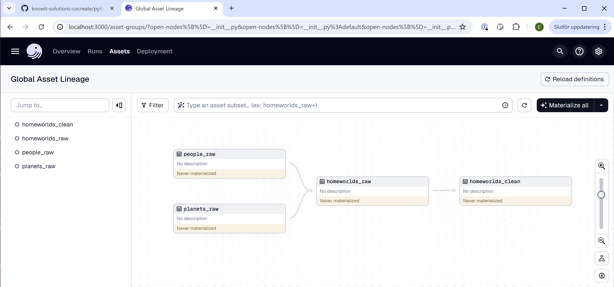

# Code for Python course lesson 3
Welcome to part three of the Python course!


## Project setup

1. Create a virtual Python environment and activate it:
    ```console
    py -m venv venv
    .\venv\Scripts\activate  # run this step again whenever you open a new terminal
    ```
2. Select the Python interpreter within the virtual environment for VSCode to use: Ctrl+Shift+P, type "Python: Select Interpreter" and choose (or navigate to) .\venv\Scripts\python.exe
3. Install the Python code:
    ```console
    py -m pip install --editable ./
    ```
4. Start dagster:
    ```console
    dagster dev -m lesson_3_code
    ```
5. Open http://localhost:3000/asset-groups in a browser, which should give you the following:
    
